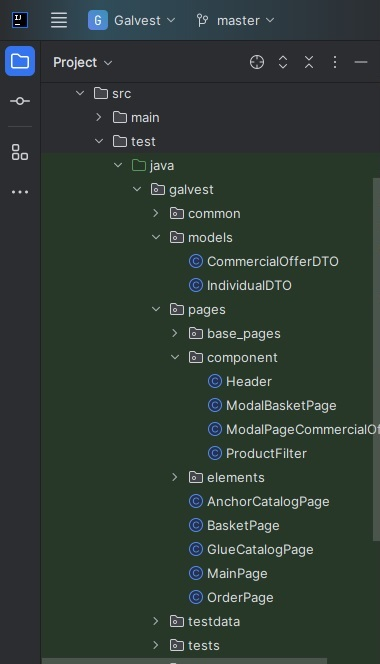
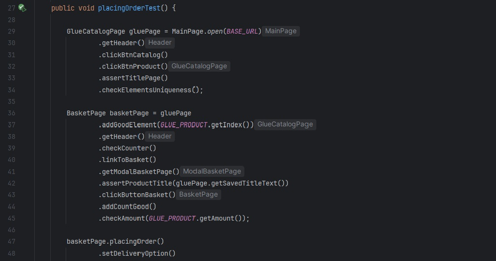
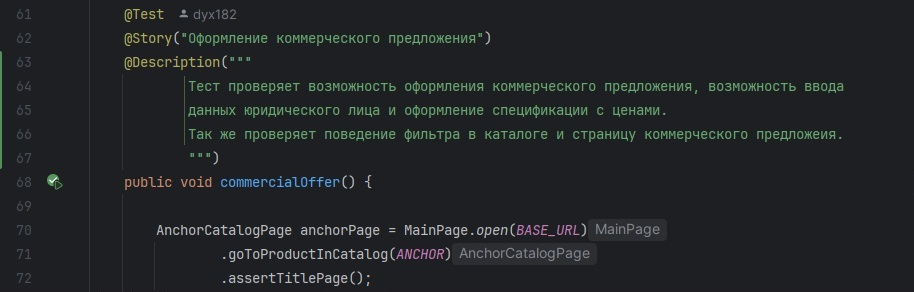

# Автоматизированные тесты интернет-магазина промышленной химии

Набор end-to-end тестов для веб-платформы промышленной химии, охватывающих ключевые пользовательские сценарии. Реализован с использованием современных инструментов тестирования с применением паттерна Page Object Model.

## Технологический стек
- **Selenide 7.8.0** - Основной фреймворк
- **JUnit 5** - Запуск тестов
- **Maven** - Сборка
- **Allure Report 2.24** - Отчётность
- **Lombok 1.18.30** - Для уменьшения шаблонного кода
 
## Особенности реализации
- Гибридная Page Object Model + Component-based design. Для безопасной передачи тестовых данных между слоями теста используется Data Transfer Objects

- Для читаемости и поддерживаемости тестов используется Fluent Interface, тест при данном подходе полностью повторяет user-flow

- Применение Allure для улучшение понимания бизнес логики и составления наглядных отчетов

## Покрытие тестами:
- Покрытие основного функционала Каталога
- Покрытие функционала корзины
- Покрытие всех вариантов платежных сценариев страницы Оформления заказов
  
## Установка и запуск
1. Клонировать репозиторий:
   git clone https://github.com/yourrepo/industrial-chem-ui-tests.git
2. Запустить тесты:
   mvn test -Dbase.url=https://galvest.ru

# Automated Testing for Industrial Chemical E-Commerce Platform

Comprehensive end-to-end test suite for an industrial chemicals web platform, covering critical user workflows. Implemented using modern testing tools following Page Object Model principles.

## Technology Stack
- Selenide 7.8.0 - Core test framework
- JUnit 5 - Test runner
- Maven - Build automation
- Allure Report 2.24 - Test reporting

## Implementation Highlights

- Hybrid Page Object Model with Component-based architecture
- Fluent Interface for improved test readability
- Allure integration for enhanced business logic visualization and comprehensive reporting

## Test Coverage:
- Core catalog functionality
- Shopping cart operations
- Complete checkout payment scenarios

## Installation & Execution
1. Clone repository:
   git clone https://github.com/yourrepo/industrial-chem-ui-tests.git
2. Run tests:
   mvn test -Dbase.url=https://galvest.ru
